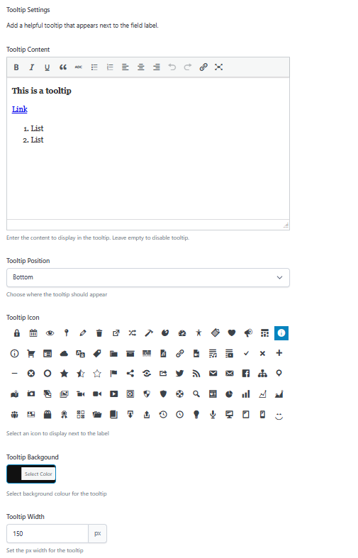
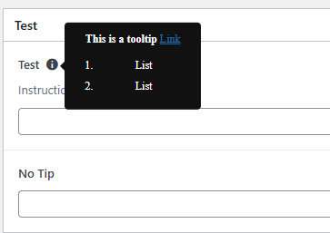

# ACF Tooltips by SimpliWeb

A WordPress plugin that adds customisable tooltip functionality to Advanced Custom Fields (ACF). Display helpful information next to field labels with beautiful hover tooltips or click-to-open modals featuring custom icons, colours, and positioning.


## Features

- 🎨 **Rich Content Editor** - Use the WYSIWYG editor to create formatted tooltip content
- 🖱️ **Modal Mode** - Toggle between hover tooltips and click-to-open modal popups
- 🎯 **4 Positioning Options** - Display tooltips above, below, left, or right of the icon (hover mode)
- 🎭 **80+ Dashicons** - Choose from WordPress's built-in icon library
- 🔌 **Custom Icon Support** - Add your own icons via filters (Font Awesome, SVG, images)
- 🌈 **Custom Colours** - Set custom background colours for each tooltip
- 📏 **Adjustable Width** - Control the pixel width of each tooltip (hover mode)
- 🔧 **Works with All ACF Fields** - Automatically adds tooltip settings to every ACF field type
- 🎣 **Developer Friendly** - Multiple hooks and filters for customisation
- 💼 **Easy to Use** - Simple interface integrated directly into ACF's field settings
- ⌨️ **Keyboard Accessible** - Modal tooltips close with the Escape key

## Screenshots

### Field Settings Panel


*Configure tooltips directly in ACF's field settings under the Presentation tab*

### Field Tooltip View


*Tooltips appear when hovering over the icon next to field labels*

## Requirements

- WordPress 5.0 or higher
- Advanced Custom Fields (ACF) 6.0 or higher (Free or Pro)
- PHP 7.0 or higher

## Installation

### Manual Installation

1. Download the latest release from this repository
2. Upload the `acf-tooltips` folder to `/wp-content/plugins/`
3. Activate the plugin through the 'Plugins' menu in WordPress
4. Navigate to any ACF Field Group and edit a field to see the new Tooltip Settings

### Git Clone
```bash
cd wp-content/plugins
git clone https://github.com/westcoastdigital/Simpli-ACF-Tooltips.git
```

Then activate the plugin in WordPress.

## Usage

### Adding a Tooltip to an ACF Field

1. Edit any ACF Field Group
2. Click on a field to open its settings
3. Scroll to the **Presentation** tab
4. Find the **Tooltip Settings** section
5. Configure your tooltip:
   - **Tooltip Content** - Enter your help text (supports HTML formatting)
   - **Tooltip Position** - Choose where the tooltip appears (top, right, bottom, left) - *only applies to hover mode*
   - **Tooltip Icon** - Select a Dashicon to display next to the label
   - **Tooltip Background** - Pick a custom background colour
   - **Open as Modal** - Toggle on to display tooltip as a click-to-open modal popup
   - **Tooltip Width** - Set the pixel width of the tooltip popup - *only applies to hover mode*

### Tooltip Display Modes

#### Hover Mode (Default)
- Tooltip appears on hover
- Position can be set to top, right, bottom, or left
- Width is customisable
- Ideal for short, quick-reference content

#### Modal Mode
- Tooltip opens as a centered popup when icon is clicked
- Fixed width of 480px with responsive max-width
- Features a close button (× in top-right corner)
- Closes by clicking:
  - The close button
  - Outside the modal (on the overlay)
  - The Escape key
- Dark overlay dims the background
- Scrollable content for longer help text
- Perfect for detailed instructions or rich content

### Example Use Cases

- **Help Documentation** - Provide detailed instructions for complex fields
- **Field Clarification** - Explain what data should be entered
- **Technical Notes** - Add developer notes or field relationships
- **User Guidance** - Help content editors understand field purposes
- **Validation Rules** - Explain format requirements or restrictions
- **Detailed Instructions** - Use modal mode for step-by-step guides with images
- **Video Tutorials** - Embed video content in modal tooltips

## Configuration

All tooltip settings are configured per-field through ACF's field settings interface. No global configuration is required.

### Available Settings

| Setting | Type | Default | Description |
|---------|------|---------|-------------|
| Tooltip Content | WYSIWYG | Empty | The HTML content displayed in the tooltip |
| Tooltip Position | Select | Top | Where the tooltip appears relative to the icon (hover mode only) |
| Tooltip Icon | Radio (Icons) | Info | The Dashicon displayed next to the label |
| Tooltip Background | Colour Picker | #111111 | Background colour of the tooltip popup |
| Open as Modal | True/False | Off | Toggle to display tooltip as a click-to-open modal |
| Tooltip Width | Number | 150px | Pixel width of the tooltip popup (hover mode only) |

## File Structure
```
acf-tooltips/
├── css/
│   └── admin.css          # Tooltip and icon selector styling
├── js/
│   └── admin.js           # Tooltip JavaScript functionality
├── images/                # Screenshots for README
│   ├── acf-tooltip-settings.png
│   └── acf-tooltip-field.png
├── acf-tooltips.php       # Main plugin file
├── README.md
└── LICENSE
```

## Developer Hooks & Filters

### Custom Icons Filter

Developers can add custom icons to the tooltip icon selector using the `sb_acf_tooltip_icons` filter.

#### Basic Usage

Add this code to your theme's `functions.php` file:
```php
/**
 * Add custom icons to ACF Tooltips
 */
add_filter('sb_acf_tooltip_icons', function($icons) {
    // Add more Dashicons
    $icons['dashicons-admin-home'] = '<span class="dashicons dashicons-admin-home"></span>';
    $icons['dashicons-warning'] = '<span class="dashicons dashicons-warning"></span>';
    
    return $icons;
});
```

#### Add Font Awesome Icons
```php
/**
 * Add Font Awesome icons to ACF Tooltips
 * Make sure Font Awesome is enqueued in your theme
 */
add_filter('sb_acf_tooltip_icons', function($icons) {
    $font_awesome_icons = array(
        'fa-rocket' => '<i class="fa fa-rocket"></i>',
        'fa-heart' => '<i class="fa fa-heart"></i>',
        'fa-star' => '<i class="fa fa-star"></i>',
        'fa-user' => '<i class="fa fa-user"></i>',
        'fa-cog' => '<i class="fa fa-cog"></i>',
        'fa-lightbulb' => '<i class="fa fa-lightbulb"></i>',
        'fa-bell' => '<i class="fa fa-bell"></i>',
    );
    
    return array_merge($icons, $font_awesome_icons);
});

// Enqueue Font Awesome in admin
add_action('admin_enqueue_scripts', function() {
    wp_enqueue_style('font-awesome', 'https://cdnjs.cloudflare.com/ajax/libs/font-awesome/6.4.0/css/all.min.css');
});
```

#### Add Custom SVG Icons
```php
/**
 * Add custom SVG icons to ACF Tooltips
 */
add_filter('sb_acf_tooltip_icons', function($icons) {
    $svg_icons = array(
        'custom-help' => '<span class="custom-icon">' . file_get_contents(get_template_directory() . '/images/icons/help.svg') . '</span>',
        'custom-info' => '<span class="custom-icon">' . file_get_contents(get_template_directory() . '/images/icons/info.svg') . '</span>',
        'custom-warning' => '<span class="custom-icon">' . file_get_contents(get_template_directory() . '/images/icons/warning.svg') . '</span>',
    );
    
    return array_merge($icons, $svg_icons);
});

// Add CSS to size custom SVG icons
add_action('admin_head', function() {
    echo '<style>
        .custom-icon svg {
            width: 20px;
            height: 20px;
            fill: currentColor;
        }
    </style>';
});
```

#### Add Image Icons
```php
/**
 * Add custom image icons to ACF Tooltips
 */
add_filter('sb_acf_tooltip_icons', function($icons) {
    $template_url = get_template_directory_uri();
    
    $image_icons = array(
        'brand-icon' => '',
        'custom-help' => '',
        'premium-icon' => '',
    );
    
    return array_merge($icons, $image_icons);
});
```

#### Replace All Default Icons
```php
/**
 * Replace all default icons with custom ones
 */
add_filter('sb_acf_tooltip_icons', function($icons) {
    // Return only your custom icons (ignores defaults)
    return array(
        'my-icon-1' => '<i class="my-icon-1"></i>',
        'my-icon-2' => '<i class="my-icon-2"></i>',
        'my-icon-3' => '<i class="my-icon-3"></i>',
    );
});
```

#### Conditionally Add Icons Based on User Role
```php
/**
 * Add premium icons only for administrators
 */
add_filter('sb_acf_tooltip_icons', function($icons) {
    if (current_user_can('manage_options')) {
        $premium_icons = array(
            'premium-star' => '<span class="premium-icon">⭐</span>',
            'premium-crown' => '<span class="premium-icon">👑</span>',
            'premium-diamond' => '<span class="premium-icon">💎</span>',
        );
        
        $icons = array_merge($icons, $premium_icons);
    }
    
    return $icons;
});
```

#### Icon Format Requirements

- **Key**: CSS class or unique identifier for the icon
- **Value**: HTML string that will be displayed in the selector and next to the field label
- **Recommended size**: 16-20px for best display in both the selector and next to labels

### Helper Method: Register Icon Library

You can also use the built-in helper method to register an entire icon library:
```php
/**
 * Register Font Awesome library using the helper method
 */
add_action('acf/init', function() {
    $tooltip_plugin = SB_ACF_Tooltips::get_instance();
    
    $fa_icons = ['home', 'user', 'heart', 'star', 'cog', 'bell', 'rocket'];
    $tooltip_plugin->register_icon_library('fa', $fa_icons, '<i class="fa fa-%s"></i>');
});
```

## Customisation

### Styling Tooltips

You can override the default tooltip styles by adding CSS to your theme:
```css
/* Change tooltip font size */
.sb-acf-tooltip-inner {
    font-size: 14px;
}

/* Adjust tooltip shadow */
.sb-acf-tooltip-inner {
    box-shadow: 0 2px 10px rgba(0,0,0,0.2);
}

/* Modify icon size */
.sb-acf-tooltip {
    font-size: 18px;
}

/* Style for custom icons */
.sb-acf-tooltip i,
.sb-acf-tooltip svg,
.sb-acf-tooltip img {
    max-width: 20px;
    max-height: 20px;
}

/* Customise modal overlay */
.sb-acf-tooltip-overlay {
    background: rgba(0, 0, 0, 0.8);
}

/* Customise modal appearance */
.sb-acf-tooltip[data-is-modal="1"] .sb-acf-tooltip-inner {
    border-radius: 12px;
    box-shadow: 0 20px 60px rgba(0, 0, 0, 0.6);
}

/* Customise modal close button */
.sb-acf-tooltip[data-is-modal="1"] .sb-acf-tooltip-inner .content-wrapper::before {
    color: #fff;
    font-size: 36px;
}
```

## Troubleshooting

### Tooltips Not Appearing

1. Make sure you've entered content in the **Tooltip Content** field
2. Verify ACF is installed and activated
3. Clear your browser cache
4. Check browser console for JavaScript errors

### Modal Not Opening

1. Ensure "Open as Modal" toggle is enabled in field settings
2. Check for JavaScript conflicts with other plugins
3. Verify jQuery is loaded properly
4. Check browser console for errors

### WYSIWYG Editor Not Loading

This plugin includes fixes for ACF's WYSIWYG editor initialisation issues. If you still experience problems:

1. Try disabling other plugins that modify ACF
2. Update to the latest version of ACF
3. Check for JavaScript conflicts in the browser console

### Icon Not Displaying

1. Ensure Dashicons are loaded (they should be by default in WordPress admin)
2. Check that you've selected an icon in the field settings
3. Verify no CSS is hiding the icon
4. For custom icons, ensure the icon library (Font Awesome, etc.) is properly enqueued

### Custom Icons Not Showing

1. Verify your filter is running on `sb_acf_tooltip_icons`
2. Check that custom icon libraries (Font Awesome, etc.) are enqueued in admin
3. Use browser dev tools to inspect the HTML output
4. Ensure your custom CSS for icons is loading

### Modal Won't Close

1. Check that JavaScript is not being blocked
2. Verify there are no console errors preventing event handlers
3. Ensure no other plugins are interfering with click events
4. Try pressing the Escape key as an alternative close method

## Technical Notes

### Modal Implementation

The modal mode uses:
- Fixed positioning to center the tooltip
- Click event handlers for opening/closing
- Escape key listener for keyboard accessibility
- Overlay element to dim background and provide click-to-close functionality
- CSS animations for smooth transitions
- Event delegation to handle dynamic content

### WYSIWYG Editor Configuration

The plugin uses specific settings to prevent editor initialisation conflicts:
- `'delay' => 1` - Delays editor initialisation
- `'quicktags' => false` - Disables quicktags to prevent JavaScript errors

These settings resolve the common ACF error: `Cannot read properties of undefined (reading 'buttons')`

### Hooks & Filters

The plugin hooks into ACF at these points:
- `acf/init` - Registers tooltip settings for all field types
- `acf/render_field_presentation_settings/type={$type}` - Adds settings to each field type
- `acf/input/admin_enqueue_scripts` - Loads admin assets
- `acf/render_field` - Renders tooltips on field output

Available filters:
- `sb_acf_tooltip_icons` - Modify available icons in the selector
- Custom icons are automatically integrated into the render process

## Browser Support

- Chrome (latest)
- Firefox (latest)
- Safari (latest)
- Edge (latest)
- IE11+ (basic functionality, modal mode may have limited support)

## Changelog

### 1.2.0 (2024-11-21)
- Added modal mode - tooltips can now open as click-to-open popups
- Added "Open as Modal" toggle setting in field configuration
- Modal features: centered display, dark overlay, close button, Escape key support
- Width setting now conditionally hidden when modal mode is enabled
- Fixed width set to 480px for modal tooltips with responsive max-width
- Added smooth animations for modal open/close
- Improved accessibility with keyboard support
- Enhanced user experience with multiple close options

### 1.1.0 (2024-11-21)
- Added custom icon support via `sb_acf_tooltip_icons` filter
- Added helper method `register_icon_library()` for bulk icon registration
- Improved icon rendering to support Font Awesome, SVG, and image icons
- Updated CSS to handle non-Dashicon icons
- Enhanced documentation with custom icon examples
- Improved flexibility for theme and plugin developers

### 1.0.0 (2024-11-20)
- Initial release
- WYSIWYG editor for tooltip content
- 4 positioning options (top, right, bottom, left)
- 80+ Dashicon selection
- Custom background colour picker
- Adjustable tooltip width
- Support for all ACF field types

## Contributing

Contributions are welcome! Please feel free to submit a Pull Request.

1. Fork the repository
2. Create your feature branch (`git checkout -b feature/AmazingFeature`)
3. Commit your changes (`git commit -m 'Add some AmazingFeature'`)
4. Push to the branch (`git push origin feature/AmazingFeature`)
5. Open a Pull Request

## Development

### Local Development Setup

1. Clone the repository into your WordPress plugins directory
2. Ensure ACF is installed
3. Activate both plugins
4. Create a test field group to work with

### Code Standards

- Follow WordPress Coding Standards
- Use proper PHPDoc blocks
- Comment complex logic
- Maintain singleton pattern

## Licence

This plugin is licensed under the GPL v2 or later.
```
Copyright (C) 2025 SimpliWeb

This program is free software; you can redistribute it and/or modify
it under the terms of the GNU General Public Licence as published by
the Free Software Foundation; either version 2 of the Licence, or
(at your option) any later version.

This program is distributed in the hope that it will be useful,
but WITHOUT ANY WARRANTY; without even the implied warranty of
MERCHANTABILITY or FITNESS FOR A PARTICULAR PURPOSE. See the
GNU General Public Licence for more details.
```

## Credits

**Developed by:** [SimpliWeb](https://simpliweb.com.au)  
**Author:** Jon Mather  
**Icons:** WordPress Dashicons

## Support

For bugs, feature requests, or support:
- Open an issue on [GitHub](https://github.com/westcoastdigital/Simpli-ACF-Tooltips/issues)
- Visit [SimpliWeb](https://simpliweb.com.au)

## Roadmap

Potential future features:
- [ ] Tooltip animations and transitions options
- [ ] Mobile-specific tooltip behaviour
- [ ] Tooltip templates/presets
- [ ] Multi-language support (WPML/Polylang)
- [ ] Frontend tooltip display option
- [x] Click-to-open option for mobile (completed - modal mode)
- [ ] Accessibility improvements (ARIA labels)
- [ ] Tooltip positioning auto-adjustment for screen edges
- [ ] Video embed support in tooltips
- [ ] Tooltip import/export functionality
- [ ] Custom modal sizes
- [ ] Tooltip groups/categories

---

**Made with ❤️ by SimpliWeb**